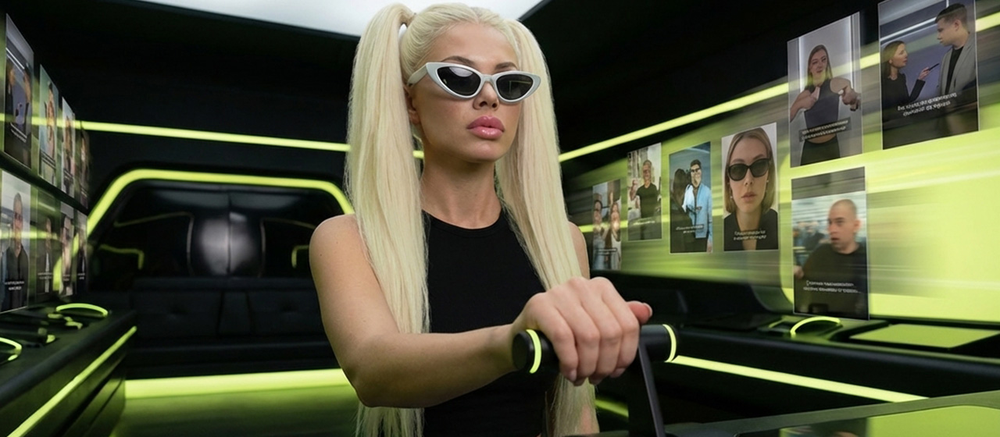
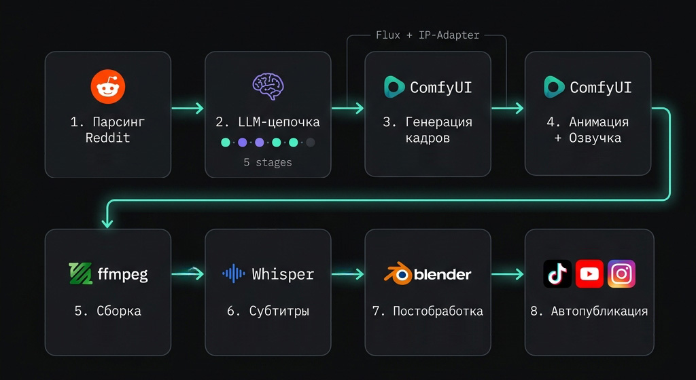
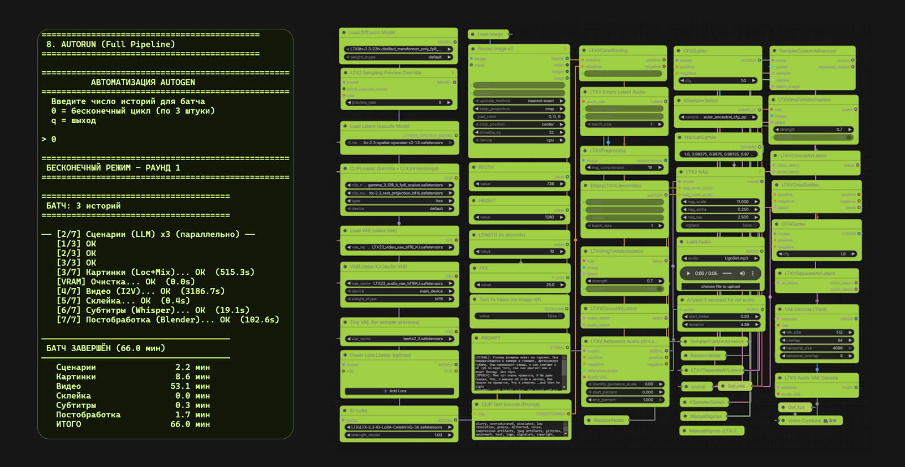

# AutoGen Video Pipeline 

> **Type:** Fully Automated AI Content Factory  
> **Output:** TikTok, YouTube Shorts, Instagram Reels  

## Overview
**AutoGen** is an end-to-end proprietary pipeline designed to autonomously convert raw text content (such as trending Reddit stories) into fully animated, dubbed, and edited short videos. 

The system operates entirely without human intervention on local infrastructure. It handles everything from data parsing and scriptwriting to cinematic generation, subtitles, and final publication via official social media APIs.

---

## ⚡ Performance Matrix
Running on a single **NVIDIA RTX 4090**, the pipeline achieves:
- **Throughput:** ~3 complete videos (20–45 seconds each) per hour.
- **Capacity:** ~72 high-quality shorts per 24-hour cycle.
- **Autonomy:** 24/7 continuous operation with built-in fault tolerance (automatically skips errors and proceeds to the next script).

---

## 🔥 Key Solutions

* **Batch Generation:** High-throughput processing with optimized stage sequencing, running multiple stories concurrently to scale production without losing quality.
* **Multi-Stage LLM Processing:** Text flows through a chain of independent LLM stages (Summarizer → Structurer → Editor → Director). This approach bypasses context-length limitations and yields a highly controllable, predictable script.
* **Algorithmic Storytelling:** Every video is built on a fixed narrative arc (hook, development, climax, resolution) to ensure high viewer retention.
* **Consistent Characters & Locations:** Seamless character swapping and decoupled scene management. This enables high visual variety without needing to retrain or rebuild the pipeline.
* **Dynamic Timing:** Video duration is calculated dynamically based on text volume, entirely eliminating abrupt cuts, dead pauses, and the need for manual retiming.
* **Content-Adaptive Engine:** Character behavior, VoiceOver intonation, and artistic style automatically adapt to the specific story, creating a cohesive atmospheric video without manual direction.

---

## 🛠 Tech Stack

### Core Architecture
- **Language:** Python
- **Orchestration:** ComfyUI API / Custom Python Scripts

### Generative Models
- **Text & Directing:** DeepSeek V3.2, Minimax M2.7, Gemini Flash (via OpenRouter)
- **Image Generation:** Flux 
- **Character Consistency:** IP-Adapter Redux
- **Video Generation:** LTX-Video (Image-to-Video)
- **VoiceOver / Audio:** Custom TTS engine
- **Transcription:** Faster-Whisper

### Post-Production & Automation
- **Subtitles:** ASS format automated generation
- **VFX & Compositing:** Blender (Cinematic color grading & lens effects)
- **Data Sourcing:** Reddit JSON API
- **Publishing:** YouTube Data API v3, TikTok Content Posting API, Meta Graph API (Instagram Reels)

---

## ⚙️ How It Works (Pipeline Overview)

1. **Trend Parsing:** Scraping top text content from selected channels, filtering by engagement and length.
2. **LLM Chain Orchestration:** Compressing, structuring, and editing raw text into a polished script with assigned shots and character behaviors.
3. **Frame Generation:** Constructing base scenes in ComfyUI with strictly consistent characters.
4. **Animation & Voicing:** LTX-Video breathes life into still frames, while TTS synthesizes emotional VO directly matched to the script.
5. **Assembly:** Auto-stitching generated scenes into a unified sequence.
6. **Subtitling:** Whisper generates time-accurate transcription for engaging embedded subtitles.
7. **Post-Processing:** Final render pass through Blender for cinematic grading and VFX.
8. **Auto-Publish:** Timed distribution to TikTok, YouTube Shorts, and Instagram Reels.

### 💻 Automated Workflow

---

## 📈 Result & Delivery

 

---
*Created by [Aleksey Efremov](https://alekseyefremov.com) — Generative AI Artist & Pipeline Engineer*
